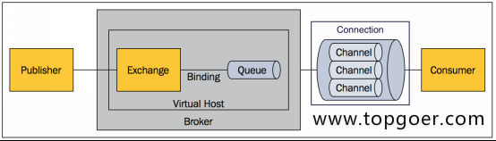
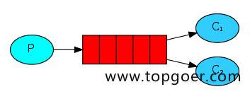
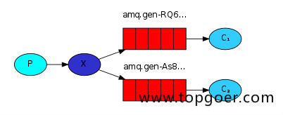
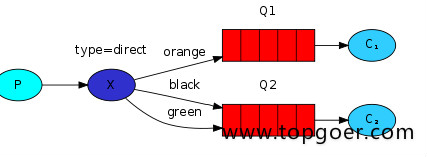
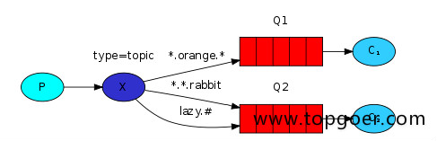

# Rabbitmq
- MQ：消息总线(Message Queue)，是一种跨进程、异步的通信机制，用于上下游传递消息。由消息系统来确保消息的可靠传递。
- 当前市面上mq的产品很多，比如RabbitMQ、Kafka、ActiveMQ、ZeroMQ和阿里巴巴捐献给Apache的RocketMQ。甚至连redis这种NoSQL都支持MQ的功能。
AMQP：Advanced Message Queue，高级消息队列协议。它是应用层协议的一个开放标准，为面向消息的中间件设计，基于此协议的客户端与消息中间件可传递消息，并不受产品、开发语言灯条件的限制。

###### RabbitMQ的特点
- 可靠性(Reliablity)：使用了一些机制来保证可靠性，比如持久化、传输确认、发布确认。
- 灵活的路由(Flexible Routing)：在消息进入队列之前，通过Exchange来路由消息。对于典型的路由功能，Rabbit已经提供了一些内置的Exchange来实现。针对更复杂的路由功能，可以将多个Exchange绑定在一起，也通过插件机制实现自己的Exchange。
- 消息集群(Clustering)：多个RabbitMQ服务器可以组成一个集群，形成一个逻辑Broker。
- 高可用(Highly Avaliable Queues)：队列可以在集群中的机器上进行镜像，使得在部分节点出问题的情况下队列仍然可用。
- 多种协议(Multi-protocol)：支持多种消息队列协议，如STOMP、MQTT等。
- 多种语言客户端(Many Clients)：几乎支持所有常用语言，比如Java、.NET、Ruby等。
- 管理界面(Management UI)：提供了易用的用户界面，使得用户可以监控和管理消息Broker的许多方面。
- 跟踪机制(Tracing)：如果消息异常，RabbitMQ提供了消息的跟踪机制，使用者可以找出发生了什么。
- 插件机制(Plugin System)：提供了许多插件，来从多方面进行扩展，也可以编辑自己的插件。

###### 简单调试
- 本地搭建rabbitmq，参考文档：https://www.cnblogs.com/eddyz/p/17339961.html 推荐docker部署
- 修改 consts.go 文件中的url配置

###### rabbitmq简单使用

- 所有MQ产品从模型抽象来说，都是一样的过程：
- 1、消费者(consumer)订阅某个队列。
- 2、生产者(product)创建消息，然后发布到队列中(queue)，最终将消息发送到监听的消费者。
  

- Broker：标识消息队列服务器实体.
- Virtual Host：虚拟主机。标识一批交换机、消息队列和相关对象。虚拟主机是共享相同的身份认证和加密环境的独立服务器域。每个vhost本质上就是一个mini版的RabbitMQ服务器，拥有自己的队列、交换器、绑定和权限机制。vhost是AMQP概念的基础，必须在链接时指定，RabbitMQ默认的vhost是 /。
- Exchange：交换器，用来接收生产者发送的消息并将这些消息路由给服务器中的队列。
- Queue：消息队列，用来保存消息直到发送给消费者。它是消息的容器，也是消息的终点。一个消息可投入一个或多个队列。消息一直在队列里面，等待消费者连接到这个队列将其取走。
- Banding：绑定，用于消息队列和交换机之间的关联。一个绑定就是基于路由键将交换机和消息队列连接起来的路由规则，所以可以将交换器理解成一个由绑定构成的路由表。
- Channel：信道，多路复用连接中的一条独立的双向数据流通道。信道是建立在真实的TCP连接内地虚拟链接，AMQP命令都是通过信道发出去的，不管是发布消息、订阅队列还是接收消息，这些动作都是通过信道完成。因为对于操作系统来说，建立和销毁TCP都是非常昂贵的开销，所以引入了信道的概念，以复用一条TCP连接。
- Connection：网络连接，比如一个TCP连接。
- Publisher：消息的生产者，也是一个向交换器发布消息的客户端应用程序。
- Consumer：消息的消费者，表示一个从一个消息队列中取得消息的客户端应用程序。
- Message：消息，消息是不具名的，它是由消息头和消息体组成。消息体是不透明的，而消息头则是由一系列的可选属性组成，这些属性包括routing-key(路由键)、priority(优先级)、delivery-mode(消息可能需要持久性存储[消息的路由模式])等。

##### Rabbitmq模式
###### 1、simple简单模式
 
- 消息产生者将消息放入队列
- 消息的消费者(consumer) 监听(while) 消息队列,如果队列中有消息,就消费掉,消息被拿走后,自动从队列中删除(隐患 消息可能没有被消费者正确处理,已经从队列中消失了,造成消息的丢失)应用场景:聊天(中间有一个过度的服务器;p端,c端)

###### 2、work工作模式(资源的竞争)

- 消息产生者将消息放入队列消费者可以有多个,消费者1,消费者2,同时监听同一个队列,消息被消费?C1 C2共同争抢当前的消息队列内容,谁先拿到谁负责消费消息(隐患,高并发情况下,默认会产生某一个消息被多个消费者共同使用,可以设置一个开关(syncronize,与同步锁的性能不一样) 保证一条消息只能被一个消费者使用)
- 应用场景:红包;大项目中的资源调度(任务分配系统不需知道哪一个任务执行系统在空闲,直接将任务扔到消息队列中,空闲的系统自动争抢)

###### 3、 publish/subscribe发布订阅(共享资源)

- X代表交换机 RabbitMQ 内部组件, Erlang 消息产生者是代码完成,代码的执行效率不高,消息产生者将消息放入交换机,交换机发布订阅把消息发送到所有消息队列中,对应消息队列的消费者拿到消息进行消费
- 相关场景:邮件群发,群聊天,广播(广告)
- 尝试创建消费队列时可能存在的配置情况：
  - queueName=""+autoDelete=true：队列名称随机生成，消费者退出消费后，再次启动队列就会删除，每次消费都是最新的消息
  - queueName="指定队列名称"+autoDelete=false：当消费者重启后还能消费在断开连接期间未消费的消息，
  - queueName 若队列名称使用了其他模式，比如simple或work模式创建的队列名，那么当subscribe订阅模式的消费者启动后就会把当前交换机exchange与队列进行了绑定，subscribe消费者依然能够消费simple或work模式下已经存在的消息
  - queueName := "BuyVip003" // uuid.New().String()
     
- rabbitmq发布订阅模式实际的消息是会存在多个消息队列queue里面吗？
  - 答案：
  - 在RabbitMQ的发布/订阅模式中，消息确实可以存在多个消息队列中。
  - 这种模式允许一个发布者将消息发送到一个交换机（exchange），然后交换机将消息路由到绑定到它的多个队列中。
  - 每个订阅者都可以有自己的队列，并且可以绑定到交换机以接收特定类型的消息。

当消息发送到交换机时，交换机会根据预定义的路由规则将消息路由到一个或多个与之绑定的队列中。这些队列可以由不同的消费者订阅，以便处理消息。这种方式允许消息被广播到多个队列中，从而实现发布/订阅模式的特性。

###### 4、 routing路由模式

- 消息生产者将消息发送给交换机按照路由判断,路由是字符串(info) 当前产生的消息携带路由字符(对象的方法),交换机根据路由的key,只能匹配上路由key对应的消息队列,对应的消费者才能消费消息;
- 根据业务功能定义路由字符串
- 从系统的代码逻辑中获取对应的功能字符串,将消息任务扔到对应的队列中业务场景:error 通知;EXCEPTION;错误通知的功能;传统意义的错误通知;客户通知;利用key路由,可以将程序中的错误封装成消息传入到消息队列中,开发者可以自定义消费者,实时接收错误;
- 注意创建和声明交换机时必须填写交换机类型kind=direct、发布消息时的路由名key="自定义"，才能按照指定的路由推送到满足路由名称的队列中

###### 5、 topic 主题模式(路由模式的一种)

- 星号井号代表通配符
- 星号代表多个单词,井号代表一个单词
- 路由功能添加模糊匹配
- 消息产生者产生消息,把消息交给交换机
- 交换机根据key的规则模糊匹配到对应的队列,由队列的监听消费者接收消息消费

##### 交换机类型 exchange.kind
- fanout【展开、广播】：把所有发送到该交换器的消息路由到所有与该交换器绑定的队列中
- direct【直接、指定】：把消息路由到那些BindingKey和RountingKey 完全匹配的队列中
- topic【主题、满足一定规则】:将消息路由到BindingKey和RountingKey 相匹配的队列中，匹配规则约定：
  - RountingKey 和 BindingKey 均为一个点“.”分隔得字符串，被点号分隔得每一段独立的字符串称为一个单词。
  - BindingKey 中可以存在两种特殊的字符串“#”和“*”，其中“*”用于匹配一个单词，“#”用于匹配零个或者多个单词。
- headers类型的交换器不依赖路由键的匹配规则来路由消息，而是根据发送的消息内容中的headers属性进行匹配。（不常用）

##### RabbitMQ运转流程

###### 生产者发送消息过程：
- 生产者连接到RabbitMQ Broker, 建立一个连接（Connection）, 开启一个信道（Channel）；
- 生产者声明一个交换器，并设置相关属性；
- 生产者声明一个队列并设置相关属性；
- 生产者通过路由键将交换器与队列绑定起来；
- 生产者发送消息至RabbitMQ Broker ，其中包含路由键、交换器等信息；
- 相应的交换器根据接收到的路由键查找相应的匹配队列；
- 如果找到，则将从生产者发送过来的消息存入相应的队列中；
- 如果没有找到，则根据生产者配置的属性选择丢弃还是回退给生产者；
- 关闭信道；
- 关闭连接。

###### 消费者接收消息的过程：
- 消费者连接到RabbitMQ Broker, 建立一个连接（Connection）, 开启一个信道（Channel）；
- 消费者向RabbitMQ Broker请求消费相应队列中的消息，可能会设置相应的回调函数；
- 等待RabbitMQ Broker回应并投递相应对列中的消息，消费者接收消息；
- 消费者确认（ack）接收到的消息；
- RabbitMQ从队列中删除相应已经被确认的消息；
- 关闭信道；
- 关闭连接。

###### queueBind方法
- 用于交换器与队列的绑定
- 只要交换机与队列绑定成功，那所有声明QueueDeclare队列的消费均能处理队列中的消息（只有一个会处理成功）

######  exchangeBind方法详解
- 用于交换器与交换器的绑定

###### 参数配置说明
- exclusive : 设置是否排他。为 true 则设置队列为排他的。如果一个队列被声明为排他队列，该队列仅对首次声明它的连接可见，并在连接断开时自动删除。这里需要注意三点:
  - 排他队列是基于连接( Connection) 可见的，同一个连接的不同信道 (Channel)是可以同时访问同一连接创建的排他队列;
  - "首次"是指如果一个连接己经声明了 一个排他队列，其他连接是不允许建立同名的排他队列的，这个与普通队列不同；
  - 即使该队列是持久化的，一旦连接关闭或者客户端退出，该排他队列都会被自动删除，这种队列适用于一个客户端同时发送和读取消息的应用场景。

- autoDelete：是否自动删除，自删除的前提是至少有一个队列或者交换器与这交换器绑定,之后所有与这个交换器绑定的队列或者交换器都与此解绑后删除,一般都设置为false
- queueName：消费者若指定了队列名称，则每次重启后声明队列时发现队列已存在则不会生成新的队列

###### Documentation 
- 学习参考文档：https://www.topgoer.com/%E6%95%B0%E6%8D%AE%E5%BA%93%E6%93%8D%E4%BD%9C/go%E6%93%8D%E4%BD%9CRabbitMQ/RabbitMQ%E4%BB%8B%E7%BB%8D.html
- RabbitMQ实战指南 https://github.com/qs-home/LearningNotes/blob/master/notes/%E8%AF%BB%E4%B9%A6%E7%AC%94%E8%AE%B0/%E3%80%8ARabbitMQ%E5%AE%9E%E6%88%98%E6%8C%87%E5%8D%97%E3%80%8B.md