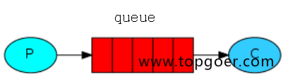
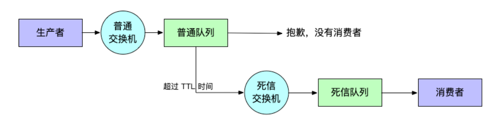
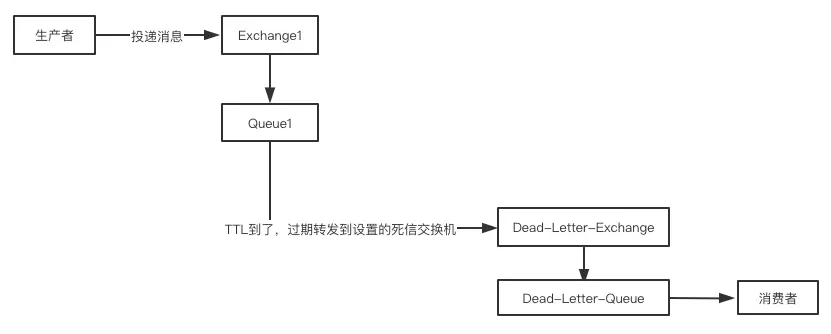

###### Documentation
- 官网文档 https://www.rabbitmq.com/getstarted.html
- 学习参考文档：https://www.topgoer.com/%E6%95%B0%E6%8D%AE%E5%BA%93%E6%93%8D%E4%BD%9C/go%E6%93%8D%E4%BD%9CRabbitMQ/RabbitMQ%E4%BB%8B%E7%BB%8D.html
- RabbitMQ实战指南 https://github.com/qs-home/LearningNotes/blob/master/notes/%E8%AF%BB%E4%B9%A6%E7%AC%94%E8%AE%B0/%E3%80%8ARabbitMQ%E5%AE%9E%E6%88%98%E6%8C%87%E5%8D%97%E3%80%8B.md
- 延迟队列 https://juejin.cn/post/6844904142155022344


###### 简单调试
- 本地搭建rabbitmq，参考文档：https://www.cnblogs.com/eddyz/p/17339961.html
- 修改 consts.go 文件中的url配置
- 本地调试：
  - cd ./test 
  - go test -run="TestSimple"

###### rabbitmq简单使用

- 所有MQ产品从模型抽象来说，都是一样的过程：
- 1、消费者(consumer)订阅某个队列。
- 2、生产者(product)创建消息，然后发布到队列中(queue)，最终将消息发送到监听的消费者。
  

- Broker：标识消息队列服务器实体.
- Virtual Host：虚拟主机。标识一批交换机、消息队列和相关对象。虚拟主机是共享相同的身份认证和加密环境的独立服务器域。每个vhost本质上就是一个mini版的RabbitMQ服务器，拥有自己的队列、交换器、绑定和权限机制。vhost是AMQP概念的基础，必须在链接时指定，RabbitMQ默认的vhost是 /。
- Exchange：交换器，用来接收生产者发送的消息并将这些消息路由给服务器中的队列。
- Queue：消息队列，用来保存消息直到发送给消费者。它是消息的容器，也是消息的终点。一个消息可投入一个或多个队列。消息一直在队列里面，等待消费者连接到这个队列将其取走。
- Banding：绑定，用于消息队列和交换机之间的关联。一个绑定就是基于路由键将交换机和消息队列连接起来的路由规则，所以可以将交换器理解成一个由绑定构成的路由表。
- Channel：信道，多路复用连接中的一条独立的双向数据流通道。信道是建立在真实的TCP连接内地虚拟链接，AMQP命令都是通过信道发出去的，不管是发布消息、订阅队列还是接收消息，这些动作都是通过信道完成。因为对于操作系统来说，建立和销毁TCP都是非常昂贵的开销，所以引入了信道的概念，以复用一条TCP连接。
- Connection：网络连接，比如一个TCP连接。
- Publisher：消息的生产者，也是一个向交换器发布消息的客户端应用程序。
- Consumer：消息的消费者，表示一个从一个消息队列中取得消息的客户端应用程序。
- Message：消息，消息是不具名的，它是由消息头和消息体组成。消息体是不透明的，而消息头则是由一系列的可选属性组成，这些属性包括routing-key(路由键)、priority(优先级)、delivery-mode(消息可能需要持久性存储[消息的路由模式])等。


##### Rabbitmq模式
Rabbitmq中的所有模式从顶层理解都是同一个模型，消息发送端都是把消息发送到交换机，然后通过交换机转发到指定的队列中，消息接收端通过声明交换机和队列进行消息消费。
- simple简单模式：
  - exchangeName交换机名称：AMQP default （默认）
  - 交换机类型：direct
  - queueName队列名称：自定义
  - 
  
- work工作模式：
  - exchangeName交换机名称：AMQP default （默认）
  - queueName队列名称：自定义
  - 交换机类型：direct
  - 同simple一致，只是允许多个消费者进行抢占式消息消费
  - 应用场景:红包;大项目中的资源调度(任务分配系统不需知道哪一个任务执行系统在空闲,直接将任务扔到消息队列中,空闲的系统自动争抢)
  - 
  
- publish/subscribe发布订阅(共享资源)模式：
  - 当消息发送到交换机时，交换机会根据预定义的路由规则将消息路由到一个或多个与之绑定的队列中。这些队列可以由不同的消费者订阅，以便处理消息。这种方式允许消息被广播到多个队列中，从而实现发布/订阅模式的特性。
  - exchangeName交换机名称：AMQP default （默认）
  - 交换机类型：fanout （扇形展开模式，意味着绑定了这个交换机的消息队列均能收到从这个交换机中发出的消息）
  - queueName队列名称：可以不指定（每次重启消费队列均会自动生成新的名称），消费端在声明交换机时交换机名称与发送端一致就能收到从交换机中发送的最新数据；同时也允许指定消费队列名称，这样下次重启后还能消费历史的消息（当使用发布订阅模式时不建议设置队列名称，违背理念）
  - 相关场景:邮件群发,群聊天,广播(广告)
  - 尝试创建消费队列时可能存在的配置情况：
    - queueName=""+autoDelete=true：队列名称随机生成，消费者退出消费后，再次启动队列就会删除，每次消费都是最新的消息
    - queueName="指定队列名称"+autoDelete=false：当消费者重启后还能消费在断开连接期间未消费的消息，
    - queueName 若队列名称使用了其他模式，比如simple或work模式创建的队列名，那么当subscribe订阅模式的消费者启动后就会把当前交换机exchange与队列进行了绑定，subscribe消费者依然能够消费simple或work模式下已经存在的消息
    - queueName := "BuyVip003" // uuid.New().String()
  - rabbitmq发布订阅模式实际的消息是会存在多个消息队列queue里面吗？
    - 答案：
    - 在RabbitMQ的发布/订阅模式中，消息确实可以存在多个消息队列中。
    - 这种模式允许一个发布者将消息发送到一个交换机（exchange），然后交换机将消息路由到绑定到它的多个队列中。
    - 每个订阅者都可以有自己的队列，并且可以绑定到交换机以接收特定类型的消息。

    - 

- routing路由模式
  - exchangeName交换机名称：手动指定
  - queueName队列名称：无需指定
  - 交换机类型：direct
  - 消息生产者将消息发送给交换机按照路由判断,路由是字符串(info) 当前产生的消息携带路由字符(对象的方法),交换机根据路由的key,只能匹配上路由key对应的消息队列,对应的消费者才能消费消息;
  - 
  
- topic 主题模式(路由模式的一种)
  - exchangeName交换机名称：手动指定
  - queueName队列名称：无需指定
  - 交换机类型：topic
  - 星号井号代表通配符
  - 星号代表多个单词,井号代表一个单词
  - 路由功能添加模糊匹配
  - 消息产生者产生消息,把消息交给交换机
  - 交换机根据key的规则模糊匹配到对应的队列,由队列的监听消费者接收消息消费
  - 用消息发送端定义的routingKey与所有绑定相同交换机的消费队列声明的key进行规则匹配（星号*代表多个单词,井号#代表一个单词），匹配成功消息进入对应的消息队列
  -
  - 示例：

- topic模式示例
```
    //先启动A：  go test -run="TestTopicConsumeMessageA" key=order.#
    //再启动B：  go test -run="TestTopicConsumeMessageB" key=order.create.*
    //最后启动消息发送：  go test -run="TestTopicSendMessage" key=order.create.confirm  用这个key去匹配每一个绑定相同交换机的key规则，规则匹配成功，则消息推入对应的队列
```

##### RabbitMQ运转流程

###### 生产者发送消息过程：
- 生产者连接到RabbitMQ Broker, 建立一个连接（Connection）, 开启一个信道（Channel）；
- 生产者声明一个交换器，并设置相关属性；
- 生产者声明一个队列并设置相关属性；
- 生产者通过路由键将交换器与队列绑定起来；
- 生产者发送消息至RabbitMQ Broker ，其中包含路由键、交换器等信息；
- 相应的交换器根据接收到的路由键查找相应的匹配队列；
- 如果找到，则将从生产者发送过来的消息存入相应的队列中；
- 如果没有找到，则根据生产者配置的属性选择丢弃还是回退给生产者；
- 关闭信道；
- 关闭连接。


###### 消费者接收消息的过程：
- 消费者连接到RabbitMQ Broker, 建立一个连接（Connection）, 开启一个信道（Channel）；
- 消费者向RabbitMQ Broker请求消费相应队列中的消息，可能会设置相应的回调函数；
- 等待RabbitMQ Broker回应并投递相应对列中的消息，消费者接收消息；
- 消费者确认（ack）接收到的消息；
- RabbitMQ从队列中删除相应已经被确认的消息；
- 关闭信道；
- 关闭连接。


###### queueBind方法
- 用于交换器与队列的绑定
- 只要交换机与队列绑定成功，那所有声明QueueDeclare队列的消费均能处理队列中的消息（只有一个会处理成功）

######  exchangeBind方法详解
- 用于交换器与交换器的绑定


###### 参数配置说明
- exclusive : 设置是否排他。为 true 则设置队列为排他的。如果一个队列被声明为排他队列，该队列仅对首次声明它的连接可见，并在连接断开时自动删除。这里需要注意三点:
  - 排他队列是基于连接( Connection) 可见的，同一个连接的不同信道 (Channel)是可以同时访问同一连接创建的排他队列;
  - "首次"是指如果一个连接己经声明了 一个排他队列，其他连接是不允许建立同名的排他队列的，这个与普通队列不同；
  - 即使该队列是持久化的，一旦连接关闭或者客户端退出，该排他队列都会被自动删除，这种队列适用于一个客户端同时发送和读取消息的应用场景。
- autoDelete：是否自动删除，自删除的前提是至少有一个队列或者交换器与这交换器绑定,之后所有与这个交换器绑定的队列或者交换器都与此解绑后删除,一般都设置为false


##### 申明交换机方法参数说明 ExchangeDeclare(name, kind string, durable, autoDelete, internal, noWait bool, args Table)
- name：交换机名称
- kind：交换机类型
  - fanout【展开、广播】：把所有发送到该交换器的消息路由到所有与该交换器绑定的队列中
  - direct【直接、指定】：把消息路由到那些BindingKey和RountingKey 完全匹配的队列中
  - topic【话题模式】:将消息路由到BindingKey和RountingKey 相匹配的队列中，匹配规则约定：
  - RountingKey 和 BindingKey 均为一个点“.”分隔得字符串，被点号分隔得每一段独立的字符串称为一个单词。
  - BindingKey 中可以存在两种特殊的字符串“#”和“*”，其中“*”用于匹配一个单词，“#”用于匹配零个或者多个单词。
  - headers类型的交换器不依赖路由键的匹配规则来路由消息，而是根据发送的消息内容中的headers属性进行匹配。（不常用）
- durable： 设置是否持久化。 durable 设置为 true 表示持久化，反之是非持久化。持久化可以将交换器信息存盘 ，而在服务器重启的时候不会丢失相关信息。
- autoDelete：是否自动删除，当交换机与所有的消费队列断开绑定后，交换机自动被删除
- internal：是否内置,如果设置为true,则表示是内置的交换器,客户端程序无法直接发送消息到这个交换器中,只能通过交换器路由到交换器的方式
  - 当 internal 参数设置为 true 时，该交换器只能被其他交换器使用，而不能被客户端程序直接访问。
  - 这个参数通常用于一些特殊场景下，例如：
  - 在某个集群环境中，多个节点之间需要通过交换器进行内部通信，但不希望外部客户端程序能够访问这些交换器。
  - 在某些安全性要求较高的场景中，交换器需要被放置在内网环境中，以避免外部程序的攻击和访问。

- noWait：声明一个交换机时是否需要服务器的返回，如果设置为true则不需要服务器返回
- args：结构化参数，这个就是当type=header时的绑定的参数
- `注意注意注意`：已存在的交换机与再次声明的交互机属性必须一致，因此消费端和发送端声明的交换机属性应该保持一致，否则会发生错误：`PRECONDITION_FAILED - inequivalent arg 'durable' for exchange 'exchangeOrderTopic' in vhost 'shop_app': received 'false' but current is 'true'"`


##### 申明队列方法参数说明 QueueDeclare(name string, durable, autoDelete, exclusive, noWait bool, args Table)
- name：队列名称，为空时会自动创建
- durable：设置是否持久化
- autoDelete：是否自动删除
- exclusive：是否是排他队列，排他队列就是只对当前连接的多个channel可见，对于其他的RabbitMQ Connection是不可见的，并且当该连接断开之后，队列就会自动被删除掉，即便是设置为持久化。
- noWait：声明一个交换机时是否需要服务器的返回，如果设置为true则不需要服务器返回
- args：结构化参数，这个就是当type=header时的绑定的参数

##### 发布消息到交换机方法参数和返回值说明 Publish(exchange, key string, mandatory, immediate bool, msg Publishing) (err error)
- exchange：交换机名称
  - simple|work模式时交换机名称设置为空，视为使用默认值：AMQP default （默认）
  -
- key：路由key，用来绑定队列和交换机的路由键
  - 例如routing路由模式下消费队列是否能够从某个交换机获取到推送的消息，用消息中的key与队列声明时的key做比较，相同则当前消费端能够消费消息。而topic模式下匹配规则为模糊匹配
  - 常规的发布订阅模式下，key是不需要设置的，只要消费端和客户端绑定了相同的交换机，消费端就能接收消息
  - simple模式和work模式也无需设置
- mandatory：当 mandatory 参数设为 true 时，交换器无法根据自身的类型和路由键找到一个符合条件的队列，那么 RabbitMQ 会调用 Basic.Return 命令将消息返回给生产者
  - 设置为true时交换机会把错误的消息推送到注册的监听器 p.channel.NotifyReturn(make(chan amqp.Return))
  - 如果在注册的监听器中获取到消息，说明该消息在交换机中未找到合适的队列

- immediate：用于控制消息的即时投递
  - 在 RabbitMQ 的 publish 方法中，immediate 参数是一个布尔值，用于控制消息的即时投递。当 immediate 参数为 true 时，表示消息在发送后，如果无法立即被路由到队列，则会立即返回给生产者，而不是等待消息被接收者消费。如果消息无法被立即路由到队列，将会触发 Basic.Return 事件，生产者可以在该事件中处理未能被路由到队列的消息。
  - immediate 参数的作用是在一定程度上实现消息的快速反馈机制。如果生产者非常关心消息的即时投递情况，可以设置 immediate 为 true，以便在消息无法被立即路由到队列时得到通知，然后可以采取相应的错误处理措施。这对于一些对消息传递时间敏感的场景可能会有所帮助。
  - 需要注意的是，immediate 参数在 RabbitMQ 3.0 版本之后已经被废弃，并且在 RabbitMQ 3.0.0 版本之后的任何版本中将不再被支持。这是因为 immediate 参数在实践中并不是十分可靠，可能会导致一些性能问题。因此，建议不要依赖于 immediate 参数，而是通过其他方式实现对消息传递状态的监控和处理。

- msg【amqp.Publishing】：消息内容
  - DeliveryMode：amqp.Persistent, //消息持久化
  - ContentType:  "text/plain", //消息格式
  - Body:         []byte(message), //消息内容
  - MessageId:    uuid.New().String(), //支持自定义消息ID，可用于后期消息是否成功投递判断
  - Expiration: 消息失效时间，可根据此参数配合构建延迟队列（依靠死信队列）
  - 
- `注意注意注意`：
  - 该方法返回nil，表示方法用于将消息发布到 RabbitMQ 中。通过 Publish 方法，你可以将消息发送到指定的交换机，并指定相应的路由键。该方法会立即发送消息，并等待消息是否成功地被 RabbitMQ 服务器接收。但是，Publish 方法并不会等待消息是否被路由到特定的队列，也不会等待消息是否被消费者消费。
  - 若为（Direct Exchange）和主题交换器（Topic Exchange）模式推送时，可以通过设置mandatory=true，And 注册异常消息接收器（p.channel.NotifyReturn(make(chan amqp.Return))）的方式获取未推送到队列的消息，后续可根据业务需要自行判断是否再次投递
  - 通过NotifyPublish方法注册一个chan，当消息被成功发送到交换机后  
  - 消息是否推送到消息队列，应该通过消费者是否接收并且是否确认的方式来判断消费者的ack
  - 消息会存在正确推送到交换机，但是没有正确推入消息队列的情况，例如：只声明了交换机，未声明消费者和队列与交换机进行绑定

##### Channel中常用的方法说明
- `Publish`：【消息发送端：是否调用发送消息正常，不一定进入交换机】方法用于将消息发布到 RabbitMQ 中。通过 Publish 方法，你可以将消息发送到指定的交换机，并指定相应的路由键。该方法会立即发送消息，并等待消息是否成功地被 RabbitMQ 服务器接收。但是，Publish 方法并不会等待消息是否被路由到特定的队列，也不会等待消息是否被消费者消费。
- `NotifyPublish`：【消息发送端：接收消息推送到交换机的状态，是否正常进入交换机，不一定进入消息队列】方法用于注册一个 channel，用于接收`发布者确认消息`（Publisher Confirm）。在启用了 Publisher Confirm 机制后，当消息被 RabbitMQ 服务器确认接收后，会通过这个 channel 发送确认消息。这个方法主要用于获取关于消息发送状态的确认信息。
- `NotifyReturn`：【消息发送端：接收到的消息都是未进入到消息队列的消息】设置监听器来处理无法被正确路由的消息 eg：notifyMessages := p.channel.NotifyReturn(make(chan amqp.Return))
- `NotifyConfirm`：【接收消费者确认的消息信息】方法用于注册一个 channel，用于接收`消费者的确认消息`（Consumer Acknowledgement）。在消费者成功消费了一条消息后，可以通过这个 channel 发送确认消息。这个方法主要用于获取关于消息被消费的确认信息。

----------------------------------------------------------------------------------
##### 延迟队列
 RabbitMQ本身是没有实现延迟队列的，不过可以使用TTL+死信队列的方式来实现延迟队列。



##### 消息的TTL
TTL全称Time To Live，即生存时间。消息的TTL也就是消息的生存时间。在RabbitMQ中设置TTL有两种
  - 第一种是声明队列的时候，在队列的属性中设置TTL，这样该队列中的消息都会有相同的有效期
  - 第二种是发送消息时给消息设置属性，可以为每条消息都设置不同的TTL
  - 如果两者都设置，生存时间取两者最小的那一个。这里我们采用第二种，即为每条消息设置TTL

#### 死信交换机/死信队列
一个消息在满足如下的条件的时候，就会变成“死信”，并且能被投递到死信交换机（Dead-Letter-Exchange），最后进入到死信交换机绑定的队列，也称死信队列（Dead-Letter-Queue）
  - 消息被拒绝而且requeue=false
  - 消息的TTL到了，即消息过期
  - 队列排满了，排在前面的消息会被丢弃或者扔到死信路由上
死信交换机和普通的交换机是没有区别的，只是某一个设置死信交换机的队列中有消息过期了，会自动触发消息的转发，发送到死信交换机中去，再由死信交换机转发到死信队列中。死信队列也是一个普通的队列，并没有什么其它特殊的。

#### 实现步骤
- 生产者
  - A：死信交换机&死信队列：声明一个用于转发过期消息的交换机（exchange_dead）和存储消息的队列（queue_dead），并且队列和交换机进行绑定
  - B：普通交换机&普通队列：声明一个用于接收消费者发布消息的交换机（exchange_normal）和消息队列(queue_normal)，并且队列和交换机进行绑定；声明消息队列（queue_normal）时必须设置额外属性：x-dead-letter-exchange="上一步声明的死信交换机名称(exchange_dead)"；
  - 消息发送时必须设置消息过期时间（Expiration），这样当消息在普通队列过期后就自动会把消息转发到上面声明的死信交换机上。
  - 也可以在声明普通队列时设置队列层级的消息过期时间，这样在消息发送时就可以不用再设置时间，二者同时存在时取其中最小的过期时间

- 消费者
  - 为了避免启动消费时还未生成死信交换机和队列，导致不能及时消费消息，因此在启动消费者时，上面`生产者`声明的`死信交换机`步骤`A`相同，可以提前声明交换机和队列
  - 监听上面死信交换机中绑定的队列
- 总结
  - 核心在于发送消息时必须设置消息过期时间ttl，并且指定消息过期后需要转交的交换机名称（声明普通队列时增加额外属性值： x-dead-letter-exchange="死信交换机"）
  - 死信交换机和死信队列、普通交换机和普通队列，其实都是正常的交换机和队列，只是利用了队列扩展特性 x-dead-letter-exchange，能够将过期的消息自动转发而已
  - 实际消息发送在普通队列，消息消费在死信队列
----------------------------------------------------------------------------------

##### 常见问题1：消息发送到交换机，如果没有消息队列接收，会直接被丢弃吗？
在 RabbitMQ 中，如果消息发送到交换机，但是没有符合条件的队列来接收这条消息，RabbitMQ 的行为取决于交换机的类型以及是否启用了 mandatory 参数。

- Direct Exchange（直连交换机）： 如果使用 Direct Exchange，消息会根据路由键被路由到匹配的队列。如果没有匹配的队列，消息会被丢弃。
- Fanout Exchange（广播交换机）： 如果使用 Fanout Exchange，消息会被广播到所有与该交换机绑定的队列。如果没有队列与交换机绑定，消息会被丢弃。
- Topic Exchange（主题交换机）： 如果使用 Topic Exchange，消息会根据路由键和通配符规则被路由到匹配的队列。如果没有匹配的队列，消息会被丢弃。
- Headers Exchange（头部交换机）： 如果使用 Headers Exchange，消息会根据消息头的键值对被路由到匹配的队列。如果没有匹配的队列，消息会被丢弃。

在以上情况下，如果消息被 mandatory 参数设置为 true，则 RabbitMQ 会将消息返回给生产者，而不是直接丢弃。生产者可以通过监听 Basic.Return 事件来获取这些未被路由到队列的消息，并根据需要进行处理。

